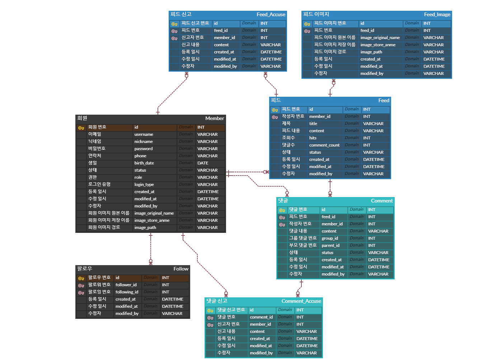
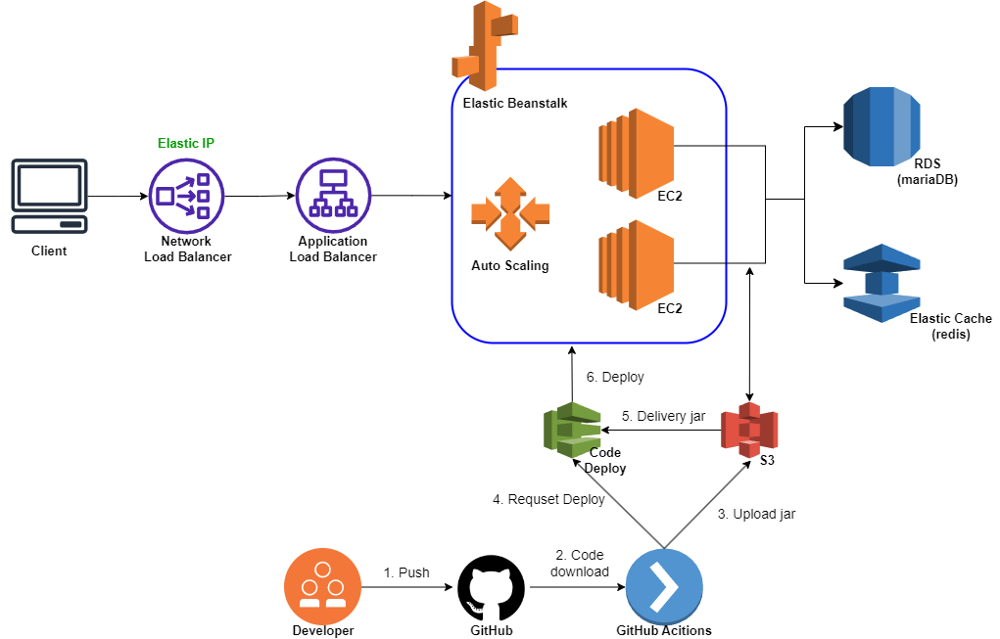

# Album
## 개요
- 회원, 팔로우, 게시글, 댓글 기능 등 간단한 SNS 웹 서비스를 구현한 프로젝트입니다.
- 개인 프로젝트
- 개발 기간
  - 1차 개발: 2023년 4월 ~ 2023년 8월
  - 로그 기능 추가: 2023년 10월
  - 캐시 기능 활용: 2023년 11월
- 도메인 주소: [http://www.maeng0830-album.com](http://www.maeng0830-album.com)
- 주요 특징
  - AWS와 GitHub Actions를 통해 클라우드 환경에 대한 무중단 배포를 구현하였습니다.
  - 트래픽 부하 분산을 위해 Elastic Load Balancer를 통해 수평적 확장을 구현하였습니다. 
  - QueryDsl을 통해 동적 쿼리를 처리하였습니다.
  - 외부 세션 저장소 및 캐시 서버를 위해 Redis를 활용하였습니다.
  - Spring Security를 통해 인증, 인가 로직을 구현하였습니다.
## 사용 기술
- 백엔드
  - Java 11, SpringBoot 2.7.1, JPA, QueryDsl, Spring Security, MariaDB, Redis, Thyemleaf
- 인프라
  - AWS, GitHub Actions
## ERD

## Architecture

## 주요 기능
### 공통 기능
- 회원 기능
- 팔로우 기능
- 피드 기능
- 댓글 기능
- 신고 기능
### 관리자 기능
- 회원 관리 기능
- 피드 관리 기능
- 댓글 관리 기능
## API 명세서
[Album API 명세서 바로가기](http://www.maeng0830-album.com/docs/index.html)
## 프로젝트 이슈
- 테스트 환경 통합
- 배포 시 환경변수 관리
- 다중 서버 환경의 세션 불일치 문제 해결
- 로그 기능 추가
- Redis Cache를 활용한 '피드 상세 조회 기능' 성능 개선
## Album 포트폴리오
[Album 포트폴리오 바로가기](https://brick-bovid-f0e.notion.site/Album-bccf700e93cb4e5ca9dff8a1fec61fa9?pvs=4)